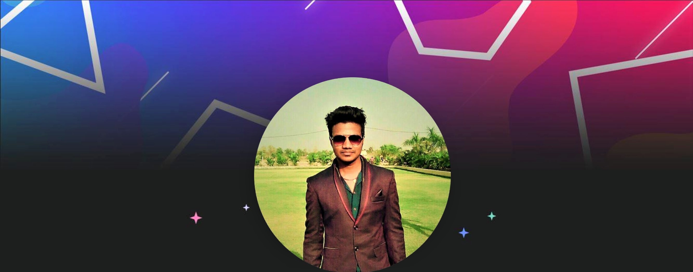

<div align="center">
  
</div>

<h3 align="center">Hey there, I’m Swapnil Pachare</h3>

<div align="center">
  I'm a <strong>Student</strong> and <strong> Web Developer</strong> who is ✨ passionate ✨ about computer science. I'm making projects or learning something just about every day. Here on my GitHub you'll find my amazing projects :)
</div>

<hr>

<div align="center">
  
  

  
  
  
</div>

<hr>

<h3>🌎 Bio</h3>

```javascript
class Swapnil {
  pronouns = "He" || "Him";
  skills = ["Github", "Full Stack", "Databases", "Testing"];
  constructor(currentlyLearning) {
    this.skills.push(currentlyLearning);
  }
  get education() {
    return "Pursuing B.Tech in Computer Science Engineering";
  }
}
let me = new Swapnil("MERN Stack");
```
<h3>Follow Me on Github</h3>
<a href="https://github.com/swapnilpachare2?tab=repositories">GITHUB Profile</a>
<div align="center">
  
</div>
